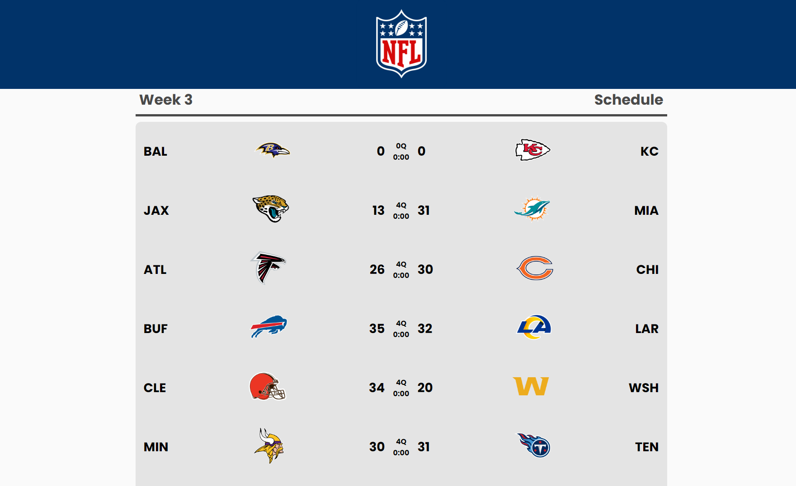
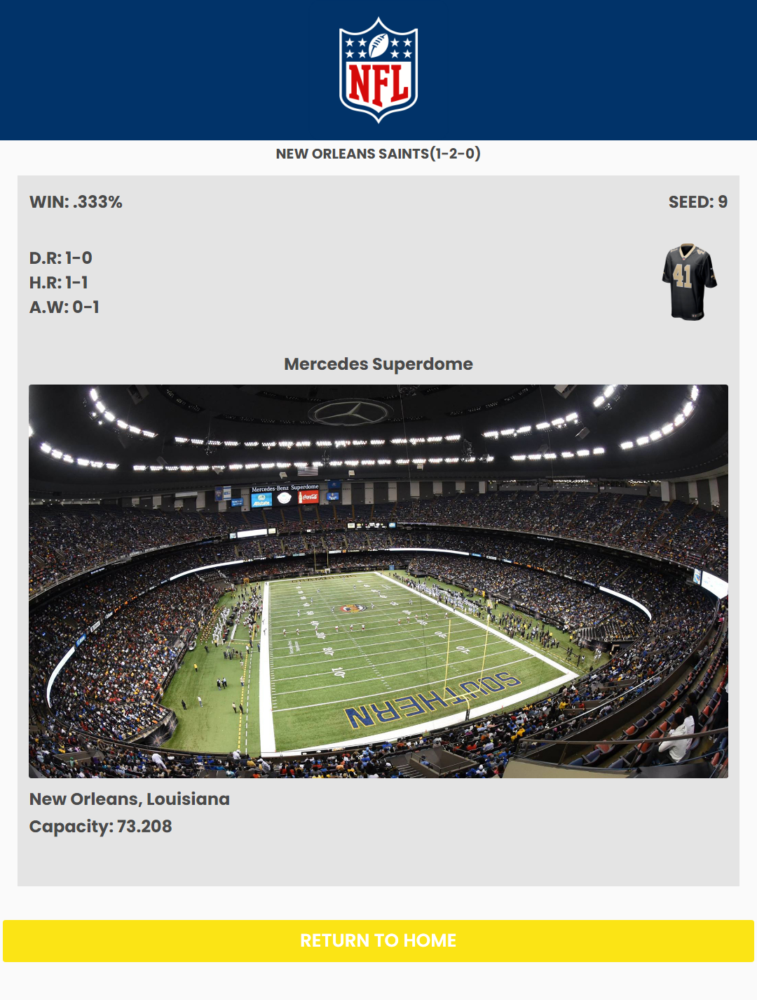

# AdorNFL

### _AdorNFL_ is an interface built with ReactJS from the ESPN and TheSportsDB APIs to present data from the NFL teams, the games and leaderboards of the week.
### Link: https://adornfl.vercel.app

## Built with:
- Axios
- ReactJs
- React-router-dom
- Styled-components
- A lot of coffee :)

## Instructions
- Open your terminal.
- Insert `git clone https://github.com/LucasAdorno/AdorNFL.git`
- Insert `cd AdorNFL`
- if you don't have nodeJS on your device, install https://nodejs.org/en/download/
- Insert the `npm i` to install all dependencies.
- Insert `npm run start` to run.

## Preview

  
  
  

